# Hội Đồng Hộ Vệ Vô Hạn: Cuộc Hội Ngũ Đa Vũ Trụ

**Thể loại:** Siêu anh hùng / Đa vũ trụ / Hành động
**Dựa trên:** "The Bamboo Sentinel" và khái niệm multiverse

---

## Chương 1: Sự Giao Thoa

Neo Saigon, sáu tháng sau khi Khoai trở thành Hộ Vệ Tre. Thành phố đã tìm thấy sự bình yên dưới sự bảo vệ của anh và sự lãnh đạo của CEO Út.

"Anh Khoai, có gì đó không ổn," Cô Út nói qua thiết bị liên lạc, giọng đầy lo lắng. "Các cảm biến năng lượng đang phát hiện những dao động lạ... giống như không gian đang bị bẻ cong."

Khoai đang tuần tra trên tầng thượng tòa nhà Phú Ông Industries (đã đổi tên thành Bamboo Tech). Anh đặt tay lên ngực, module nanotech bắt đầu phát sáng.

"Tôi cảm nhận được nó," Khoai đáp. "Năng lượng này... quen thuộc somehow."

Đột nhiên, giữa không trung trước mặt anh, không gian bắt đầu rung chuyển như mặt nước. Một vết nứt màu tím xuất hiện, rộng dần thành một cánh xoáy.

"Út, chuẩn bị hệ thống phòng thủ!" Khoai hét lên. "Có thứ gì đó sắp đến!"

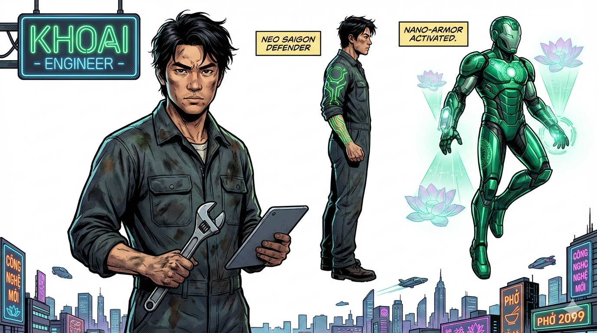

Từ cánh xoáy, một thân hình lao ra. Cô Út, nhưng không phải Cô Út của vũ trụ này. Cô mặc bộ giáp màu bạc và tím, mái tóc được cắt ngắn, ánh mắt đầy kinh nghiệm và mệt mỏi.

"Khoai!" cô hét lên. "Cậu phải nghe tôi! The Void đang đến!"

"Cô Út?" Khoai ngạc nhiên. "Nhưng... cô vừa mới liên lạc với tôi từ trụ sở."

"Tôi không phải Cô Út của cậu," người lạ nói. "Tôi đến từ Universe Beta-1984. Trong vũ trụ của tôi, cậu đã chết trong Rừng Cấm. Tôi là Hộ Vệ Tre."

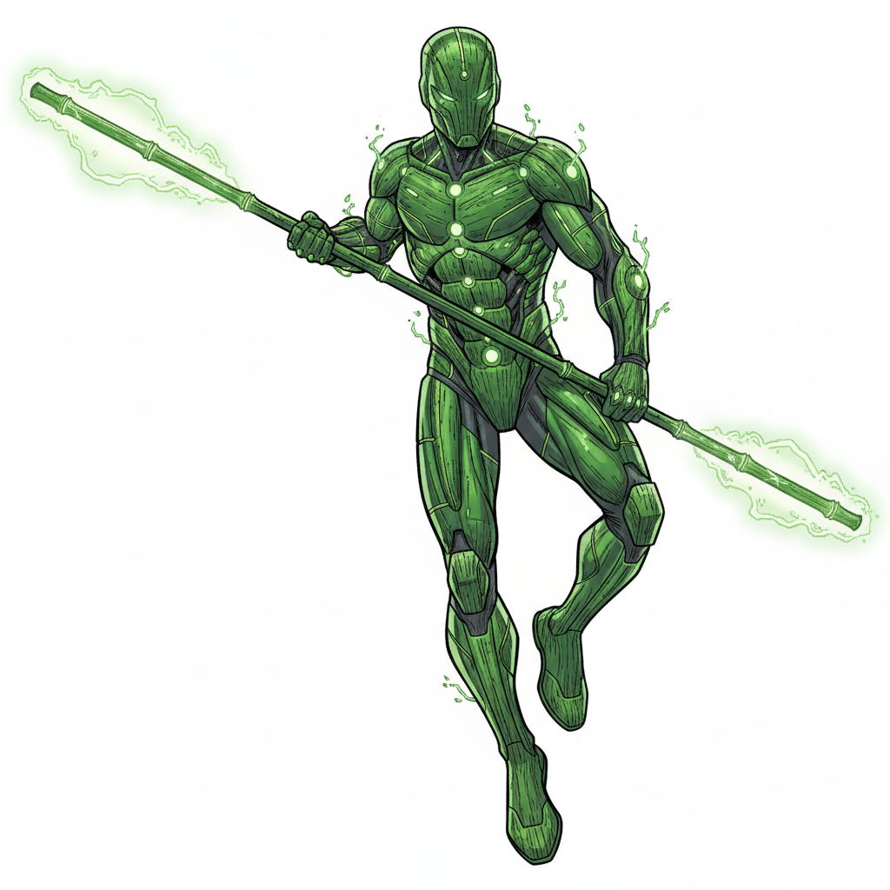

Đúng lúc đó, cánh xoáy lại rung chuyển. Lần này, một thân hình khác bước ra - Phú Ông, nhưng với bộ giáp đen đỏ dữ dội, ánh mắt đầy tham lam và hận thù.

"Thú vị," Phú Ông-Gamma cười nham hiểm. "Hai con chuột nhắt và một phiên bản yếu đuối của chính tôi."

"Phú Ông?" Khoai rút cây trượng tre. "Sao ông lại ở đây?"

"Tôi không phải Phú Ông tù nhân của cậu," gã nói. "Tôi là Phú Ông-Overlord, chủ nhân của Universe Gamma-999. Và tôi đến để lấy năng lượng nanotech của cậu."

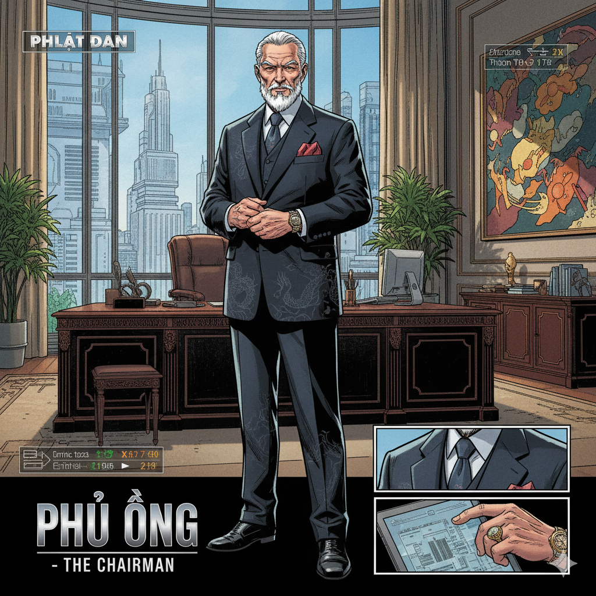

Trước khi Khoai có thể hành động, một cánh xoáy thứ ba mở ra. Khoai-Scavenger từ Universe Delta-2077 lao ra, mặc bộ giáp rách rưới, mang theo vũ khí lai ghét.

"Mọi người, chạy!" anh ta hét lên. "The Void theo sau tôi! Nó đã hủy diệt vũ trụ của tôi!"

Khoai-Scavenger ngã xuống đất, vết thương nặng nề trên người.

"Void?" Khoai Prime hỏi.

"Thực thể ăn mòn thực tại," Cô Út-Beta giải thích. "Nó xóa bỏ các vũ trụ khỏi sự tồn tại. Chúng tôi là những người sống sót cuối cùng."

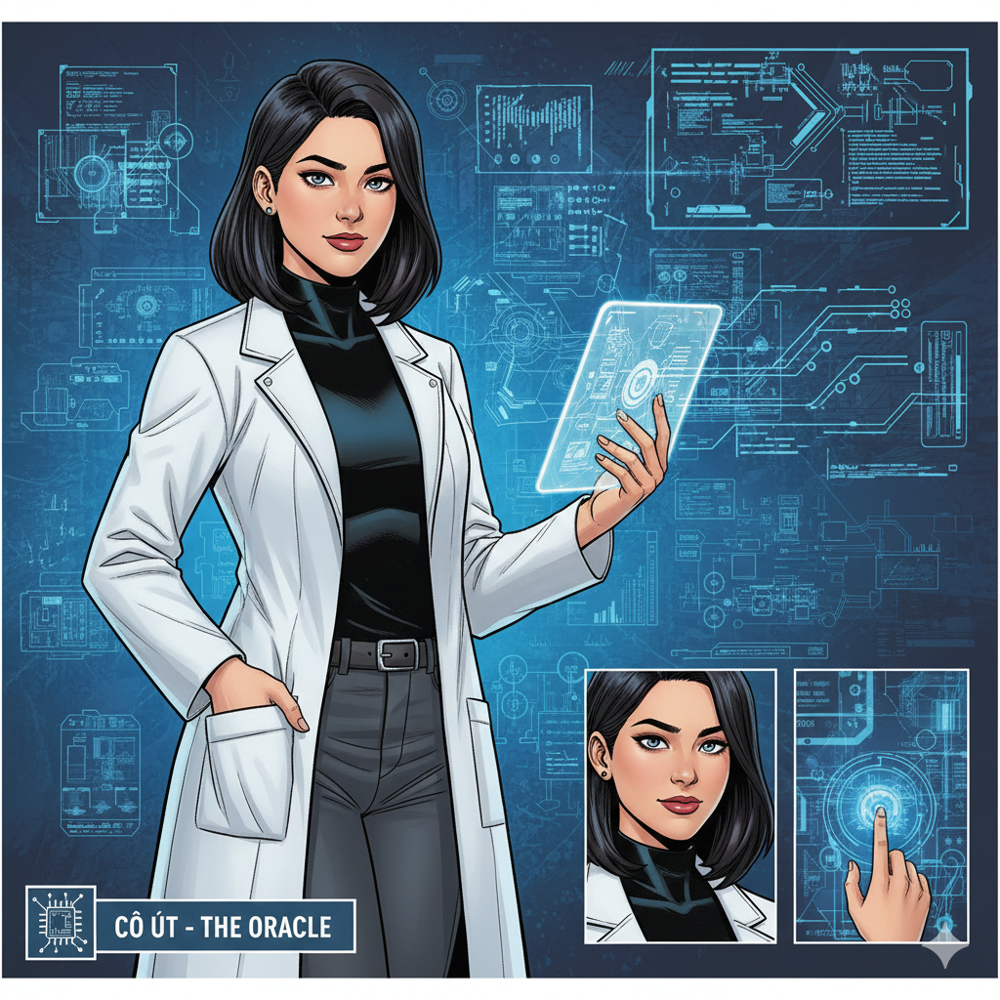

Đột nhiên, một bóng đen khổng lồ xuất hiện từ cánh xoáy. The Void - một thực thể không hình dạng, chỉ là sự trống rỗng thuần túy, bắt đầu hút mọi thứ vào nó.

"KHẮC NHẬP!" cả ba Khoai cùng hét lên.

Ba bộ giáp nanotech cùng hoạt động, tạo ra một hàng rào năng lượng. Nhưng The Void quá mạnh.

"Cần nhiều hơn thế!" Cô Út-Beta hét. "Cần tất cả chúng ta!"

Như thể lời cô có sức mạnh ma thuật, thêm hai cánh xoáy xuất hiện. Từ một bên, Cô Út-Mechanic từ Universe Epsilon-1850 bước ra với bộ giáp hơi nước tre. Từ bên kia, Bụt-Monk từ Universe Theta-1850 xuất hiện, tay cầm cây gậy tre cổ xưa.

"Thời điểm hội ngũ đã đến," Bụt-Monk nói. "Số phận đã tập hợp chúng ta."

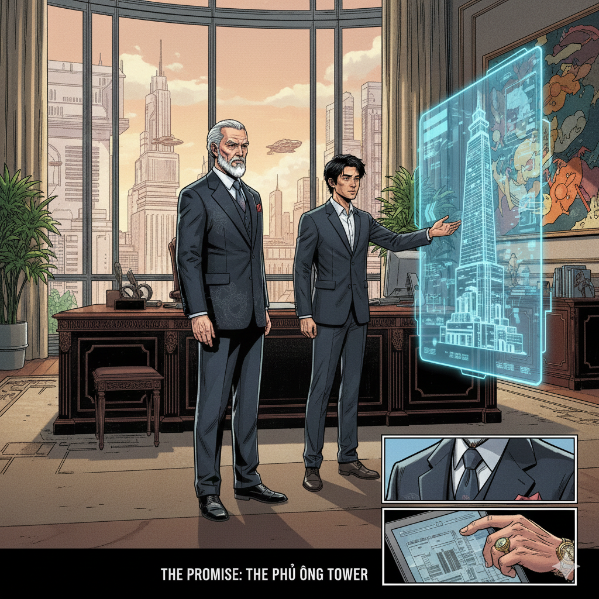

---

## Chương 2: Liên Minh Bất Đắc Dĩ

Tại tầng thượng Bamboo Tech, sáu phiên bản từ các vũ trụ khác nhau ngồi cùng nhau. Không khí căng thẳng có thể cắt được.

"Chúng ta không thể tin tưởng ông ta," Khoai Prime chỉ vào Phú Ông-Overlord. "Ông ta là phiên bản độc ác của chính mình."

"Nhưng ông ta có kiến thức về kẻ thù," Cô Út-Bite phản đối. "Trong vũ trụ của tôi, ông ta đã hy sinh để cứu chúng tôi khỏi The Void lần đầu tiên."

"Hy sinh?" Phú Ông-Gamma cười cay đắng. "Tôi chưa bao giờ hy sinh cho ai. Nhưng The Void đã lấy đi mọi thứ của tôi... kể cả con gái tôi."

Sự im lặng bao trùm phòng. Ngay cả Phú Ông-Overlord cũng có nỗi đau.

"The Void không chỉ xóa bỏ thực tại," Bụt-Monk giải thích. "Nó ăn mòn ký ức, hy vọng, và cả sự tồn tại của những người chúng ta yêu thương."

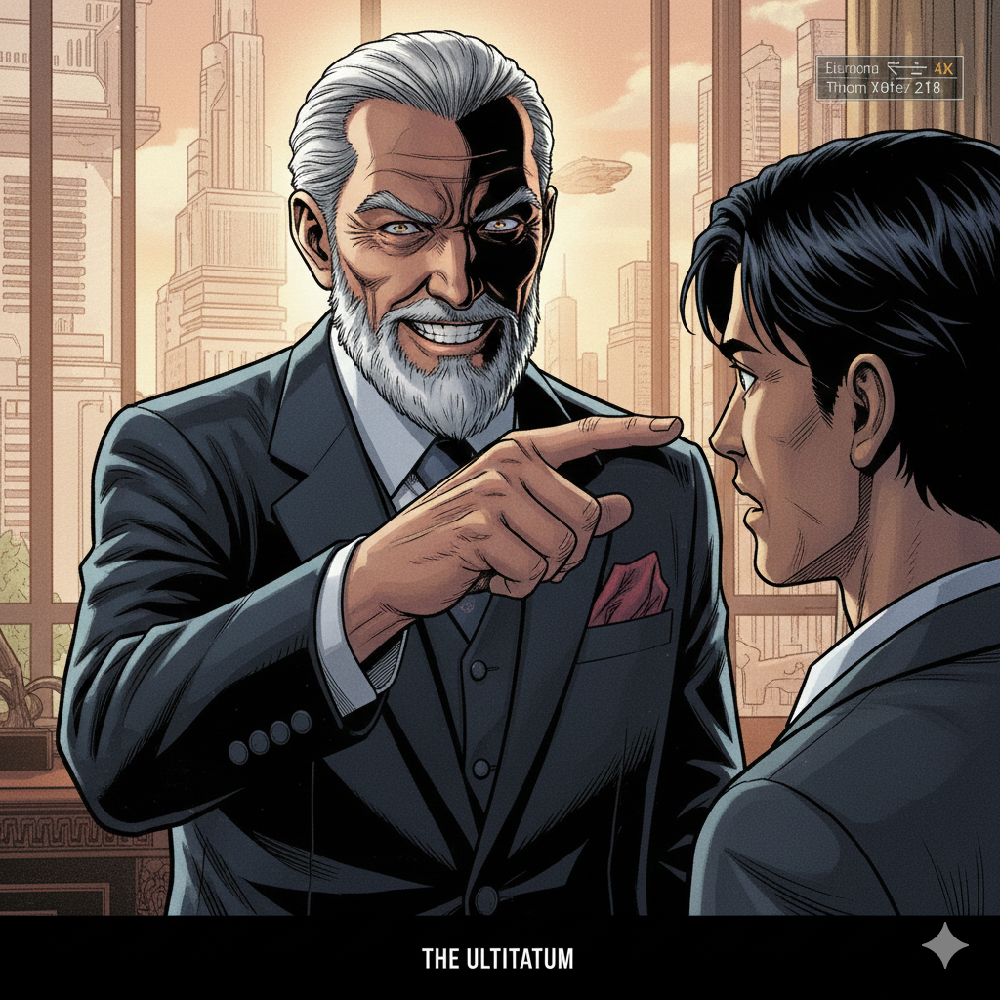

Khoai-Scavenger đứng dậy, đi về phía cửa sổ nhìn ra Neo Saigon.

"Vũ trụ của tôi đã bị hủy diệt vì chúng ta không đoàn kết," anh ta nói. "Mỗi Sentinel cố gắng chiến đấu một mình. The Void đã nhốt chúng ta và tiêu diệt từng người một."

"Chúng ta cần chiến thuật," Cô Út-Beta nói, mở một bản đồ hologram. "The Void tấn công bằng cách tạo ra các 'vết nứt thực tại' và hút các vũ trụ vào. Nếu chúng ta có thể đóng các vết nứt đó..."

"...chúng ta có thể ngăn nó lan rộng," Khoai Prime hoàn thành suy nghĩ. "Nhưng làm sao?"

"Kết hợp năng lượng," Bụt-Monk nói. "Nanotech của mỗi chúng ta mang một 'dấu ấn' từ vũ trụ của nó. Khi kết hợp, chúng tạo ra một 'thực tại ổn định' mà The Void không thể xuyên qua."

Cô Út-Mechanic giơ tay: "Công nghệ hơi nước của tôi có thể tạo ra các 'máy ổn định thực tại' nếu có đủ năng lượng."

"Và nanotech đen của tôi có thể tạo ra các 'lá chắn thực tại'," Phú Ông-Overlord thừa nhận. "Nhưng nó cần một trái tim thuần khiết để điều khiển."

"Mọi trái tim đều có thể trở nên thuần khiết," Bụt-Monk nói, nhìn thẳng vào Phú Ông-Overlord. "Nếu người đó chọn điều tốt."

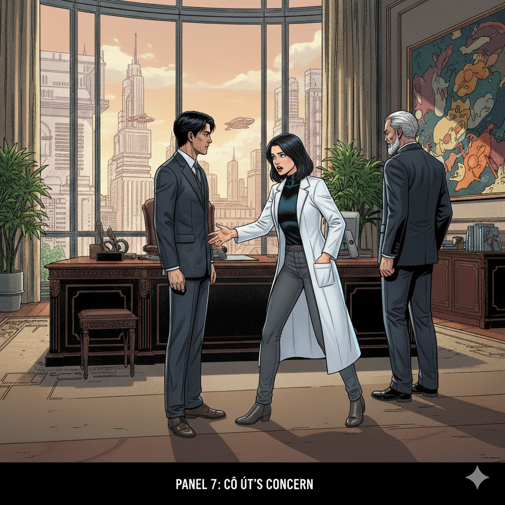

"Vậy thì chúng ta sẽ thử," Khoai Prime quyết định. "Chúng ta sẽ thành lập Hội Đồng Hộ Vệ Vô Hạn."

Cô Út-Beta mỉm cười: "Nghe cũng hay đấy."

"Nhưng chúng ta cần huấn luyện," Khoai-Scavenger nói. "Kỹ năng của chúng ta quá khác nhau. Chúng ta cần học cách hợp tác."

"Và chúng ta cần làm nhanh," Cô Út-Mechanic thêm. "Tôi cảm nhận được The Void đang tập hợp lực lượng."

---

## Chương 3: Huấn Luyện và Hợp Tác

Ba ngày tiếp theo, các Sentinel bắt đầu huấn luyện cùng nhau. Mỗi người mang những kỹ năng và kinh nghiệm riêng biệt.

Khoai Prime dạy cho mọi người về nanotech cơ bản và cách điều khiển module.

"KHẮC NHẬP không chỉ là lời nói," anh giải thích. "Đó là ý định. Các module sẽ phản ứng với suy nghĩ của bạn."

Cô Út-Beta chia sẻ chiến thuật chiến đấu đa chiều: "The Void không tấn công theo đường thẳng. Nó tạo ra các ảo ảnh thực tại để chia rẽ chúng ta."

Bụt-Monk dạy về cân bằng năng lượng: "Mỗi vũ trụ có một 'tần số' riêng. Chúng ta phải học cách điều chỉnh tần số của mình để hài hòa với người khác."

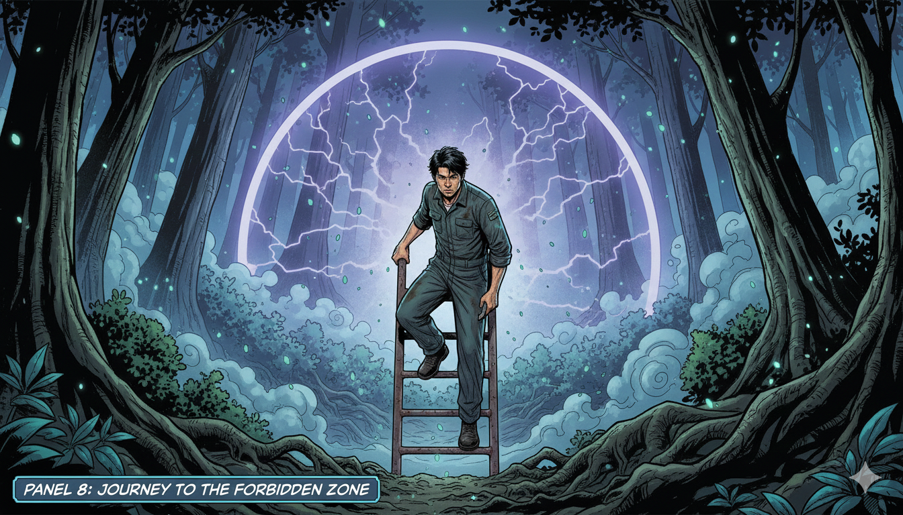

Phú Ông-Overlord là người khó khăn nhất. Nanotech đen của anh ta liên tục chống lại ý định của anh ta.

"Tôi không thể!" gã gầm lên khi một quả cầu năng lượng đen phát nổ. "Công nghệ này được sinh ra từ sự hận thù!"

"Thế thì hãy sinh ra lại từ tình yêu thương," Bụt-Monk nói, đặt tay lên vai gã. "Hãy nghĩ về con gái của ông. Ông muốn bảo vệ cô ấy như thế nào?"

Khoý nhắc đến Cô Út-Gamma, ánh mắt Phú Ông-Overlord mềm lại. Nanotech đen bắt đầu phát sáng màu tím nhạt.

"Được rồi," gã thì thầm. "Được rồi, tôi sẽ thử."

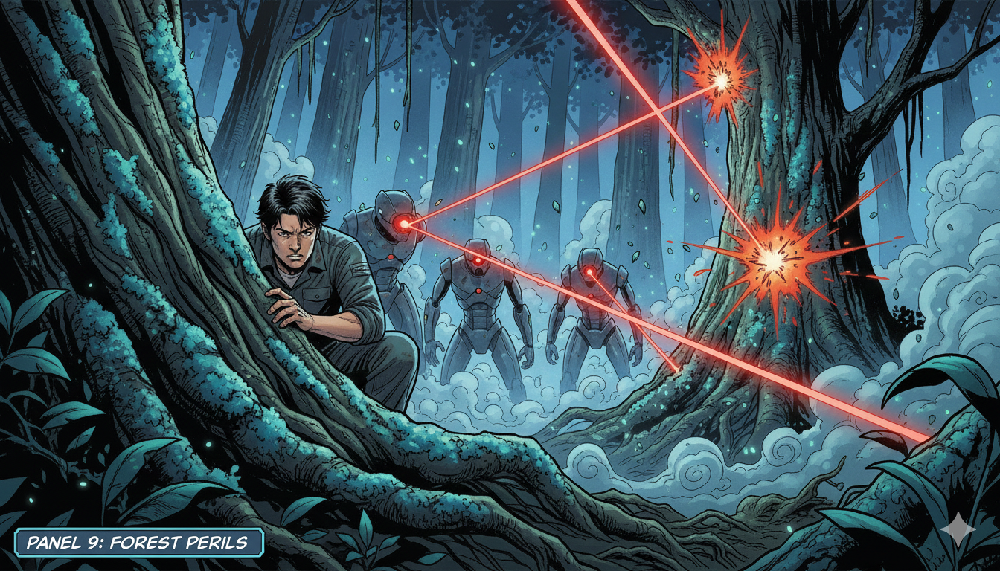

Cô Út-Mechanic và Khoai-Scavenger làm việc cùng nhau để tạo ra các máy ổn định thực tại.

"Công nghệ hơi nước của tôi hơi chậm," Cô Út-Mechanic thừa nhận.

"Nanotech của tôi có thể tăng tốc độ xử lý," Khoai-Scavenger đáp. "Nếu chúng ta kết hợp..."

Họ tạo ra một thiết bị lai ghét - máy ổn định thực tại đầu tiên.

"Tuyệt vời!" Cô Út-Beta reo lên. "Bây giờ chúng ta có thể tạo ra các 'điểm neo thực tại'!"

Nhưng huấn luyện bị gián đoạn khi cảm biến báo động.

"The Void đang tấn công!" Cô Út của vũ trụ này hét lên qua liên lạc. "Nó đã tạo ra một vết nứt lớn ở khu công nghiệp!"

"Thời gian để thử nghiệm đã kết thúc," Khoai Prime nói. "Hội Đồng, chúng ta đi!"

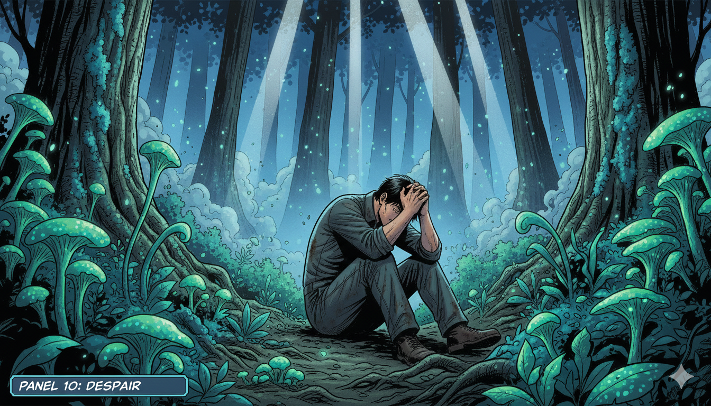

---

## Chương 4: Trận Chiến Đầu Tiên

Khu công nghiệp Neo Saigon đang chao đảo. The Void đã tạo ra một vết nứt thực tại khổng lồ, hút các tòa nhà và mọi thứ vào sự trống rỗng.

"Phân công chiến thuật!" Cô Út-Beta ra lệnh. "Khoai Prime và Bụt-Monk, hai người tấn công trực diện. Cô Út-Mechanic và Khoai-Scavenger, thiết lập máy ổn định. Phú Ông-Overlord và tôi sẽ tạo lá chắn."

"KHẮC NHẬP!" Khoai Prime hét lên, bộ giáp xanh lá phát sáng rực rỡ.

Anh lao vào The Void, cây trượng tre phát ra năng lượng sáng chói. Nhưng The Void không có hình dạng cụ thể để tấn công.

"Nó không phải vật chất!" Bụt-Monk hét lên. "Nó là sự thiếu vắng vật chất!"

"Vậy thì chúng ta sẽ lấp đầy sự thiếu vắng đó!" Khoai Prime đáp.

Anh đặt cây trượng xuống đất, và 100 module nanotech bắt đầu phát sáng, tạo ra một trường năng lượng dày đặc.

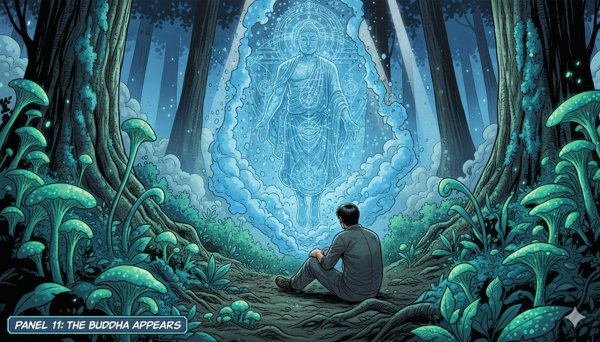

Trong khi đó, Cô Út-Mechanic và Khoai-Scavenger đang làm việc nhanh chóng để thiết lập các máy ổn định thực tại.

"Cần thêm thời gian!" Cô Út-Mechanic hét. "Các đồng hơi nước cần 5 phút để đạt áp suất tối ưu!"

"Chúng ta không có 5 phút!" Khoai-Scavenger đáp, trong khi nanotech của anh ta tạo ra các khiên bảo vệ.

Phú Ông-Overlord và Cô Út-Beta đang tạo ra một lá chắn thực tại khổng lồ.

"Năng lượng của nó quá mạnh!" Phú Ông-Overlord gầm lên. "Lá chắn không giữ được lâu!"

"Hãy nghĩ về Cô Út-Gamma!" Bụt-Monk hét. "Sức mạnh đến từ trái tim, không phải từ sự giận dữ!"

Ánh mắt Phú Ông-Overlord thay đổi. Nanotech đen của anh ta chuyển từ màu đỏ sang tím đậm. Lá chắn thực tại trở nên mạnh mẽ hơn.

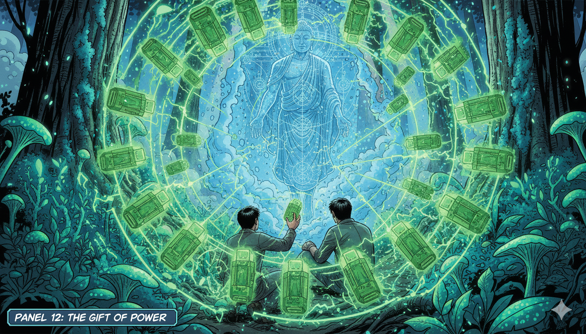

"Được rồi!" Cô Út-Mechanic reo lên. "Máy ổn định đã sẵn sàng!"

"Kích hoạt!" Khoai-Scavenger hét.

Ba máy ổn định thực tại được kích hoạt đồng thời, tạo ra một tam giác năng lượng bao quanh vết nứt.

"The Void đang yếu đi!" Cô Út-Beta báo cáo. "Nó không thể duy trì vết nứt!"

Nhưng The Void không dễ dàng từ bỏ. Nó tập trung tất cả năng lượng vào một điểm, tạo ra một tentacle đen khổng lồ tấn công về phía máy ổn định trung tâm.

"Không!" Khoai Prime hét lên, lao đến để bảo vệ.

Anh đến quá muộn.

Tentacle của The Void đập vào máy ổn định, gây ra một vụ nổ năng lượng khổng lồ.

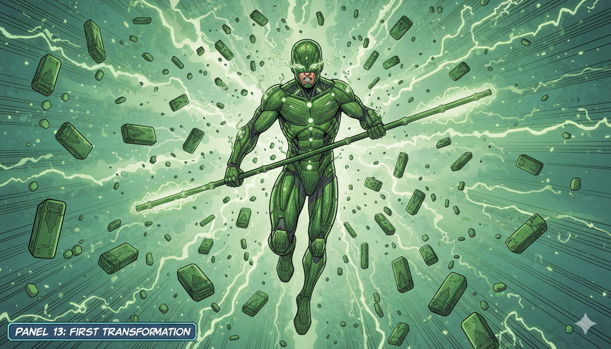

---

## Chương 5: Sự Hy Sinh

Khi khói năng lượng tan đi, Khoai-Scavenger đang đứng giữa đống đổ nát, che chắn máy ổn định bằng chính cơ thể mình. Bộ giáp của anh ta gần như bị phá hủy hoàn toàn.

"Anh... anh không sao chứ?" Khoai Prime lo lắng hỏi.

"Vũ trụ của tôi đã mất," Khoai-Scavenger cười yếu ớt. "Nhưng ít nhất... tôi đã cứu được vũ trụ của cậu."

Anh ta ngã xuống, nhưng trước khi ngất đi, anh ta trao cho Khoai Prime một module nanotech đặc biệt.

"Lấy... lấy năng lượng của tôi. Cần... cần kết hợp tất cả chúng ta."

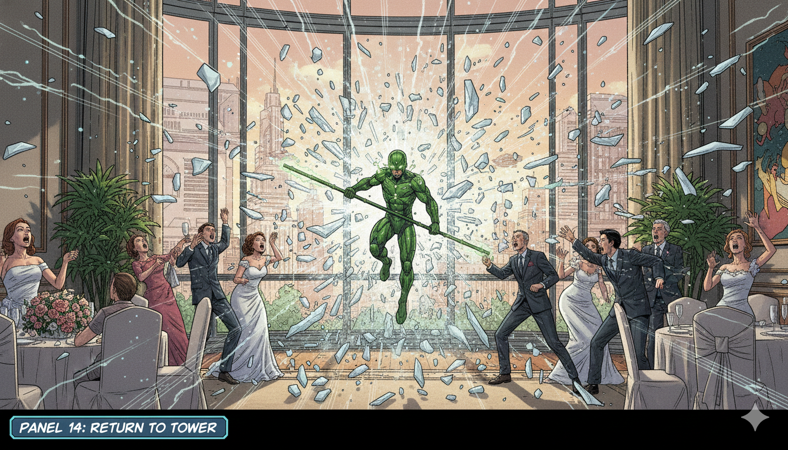

"Chúng ta phải rút lui!" Cô Út-Beta quyết định. "The Void đã yếu đi nhưng vẫn còn nguy hiểm."

Các Sentinel thu thập Khoai-Scavenger và rút về Bamboo Tech.

Tại bệnh bay của công ty, các bác sĩ đang cố gắng cứu sống Khoai-Scavenger.

"Năng lượng The Void đã ăn mòn tế bào của anh ta," bác sĩ báo cáo. "Chúng ta không thể loại bỏ nó hoàn toàn."

"Nhưng chúng ta có thể ổn định nó," Bụt-Monk nói, đặt tay lên ngực Khoai-Scavenger. "Năng lượng nanotech của cậu ta đang chiến đấu với nó. Cần một sự cân bằng."

Trong khi đó, các Sentinel còn lại đang họp khẩn cấp.

"Chúng ta đã đánh bại nó được," Cô Út-Beta nói. "Nhưng chúng ta đã mất một người."

"Và The Void sẽ quay trở lại," Phú Ông-Overlord thêm. "Lần sau nó sẽ mạnh hơn."

"Chúng ta cần một kế hoạch tốt hơn," Khoai Prime nói, nhìn module nanotech của Khoai-Scavenger. "Chúng ta cần sử dụng chính sức mạnh của nó để chống lại nó."

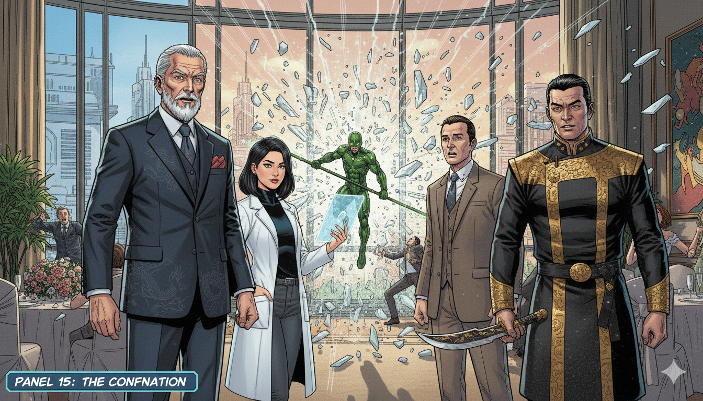

Cô Út của vũ trụ này bước vào, mang theo một ly trà cho mỗi người.

"Mọi người đều cần nghỉ ngơi," cô nói nhẹ nhàng. "Chiến tranh không thể chiến thắng trong một ngày."

Khoai Prime nhìn cô. Dù cô không phải Sentinel trong vũ trụ này, cô vẫn là người giữ cho tất cả họ đoàn kết.

"Cô nói đúng," anh đồng ý. "Hôm nay chúng ta đã học được nhiều điều. Chúng ta có thể hợp tác. Chúng ta có thể hy sinh. Và quan trọng nhất, chúng ta có thể hy vọng."

Phú Ông-Overlord đứng dậy, đi về phía cửa sổ.

"Tôi sẽ trở về vũ trụ của tôi," gã nói. "Nhưng lần này, tôi sẽ không chiến đấu một mình. Tôi sẽ tìm những người khác... những người có thể giúp chúng ta."

"Chúng ta sẽ cùng nhau chiến đấu," Khoai Prime nói. "Với tư cách là Hội Đồng Hộ Vệ Vô Hạn."

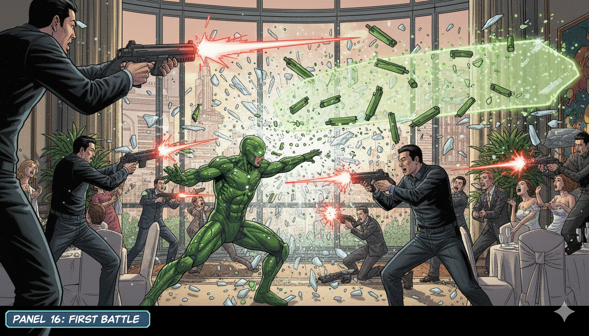

---

## Chương 6: Sự Thức Tĩnh Mới

Ba tuần trôi qua. Khoai-Scavenger đã tỉnh lại nhưng vẫn còn yếu. Các Sentinel đã thiết lập một hệ thống liên lạc đa vũ trụ.

"Tin tốt từ Universe Gamma-999," Phú Ông-Overlord báo cáo qua liên lạc. "Tôi đã tìm thấy một đồng minh. Một phiên bản khác của Bụt... một chiến binh thực tại."

"Tin xấu từ Universe Epsilon-1850," Cô Út-Mechanic nói. "The Void đã tấn công lại. Chúng tôi đã giữ được nhưng thiệt hại nặng nề."

"Chúng ta cần mở rộng Hội Đồng," Khoai Prime quyết định. "Cần nhiều Sentinel hơn."

Nhưng đột nhiên, một cánh xoáy mới mở ra - lần này màu vàng sáng thay vì tím.

"Điều gì đang xảy ra?" Cô Út-Beta hỏi.

Từ cánh xoáy, một thực thể hoàn toàn khác bước ra. Nó trông giống như một phiên bản hoàn hảo của Khoai, nhưng với bộ giáp trắng bạc và ánh mắt đầy uy quyền.

"Tôi là Khoai-Prime từ Universe Alpha-1000," thực thể nói. "Chủ tịch của Hội Đồng Hộ Vệ Vô Hạn Chinh Phục."

"Chinh phục?" Khoai Prime của chúng ta hỏi. "Chúng tôi bảo vệ, không phải chinh phục."

"Sự ngây thơ," Khoai-1000 cười. "The Void không thể bị ngăn chặn. Nó chỉ có thể được kiểm soát. Và chúng tôi sẽ kiểm soát nó để thống trị tất cả các vũ trụ."

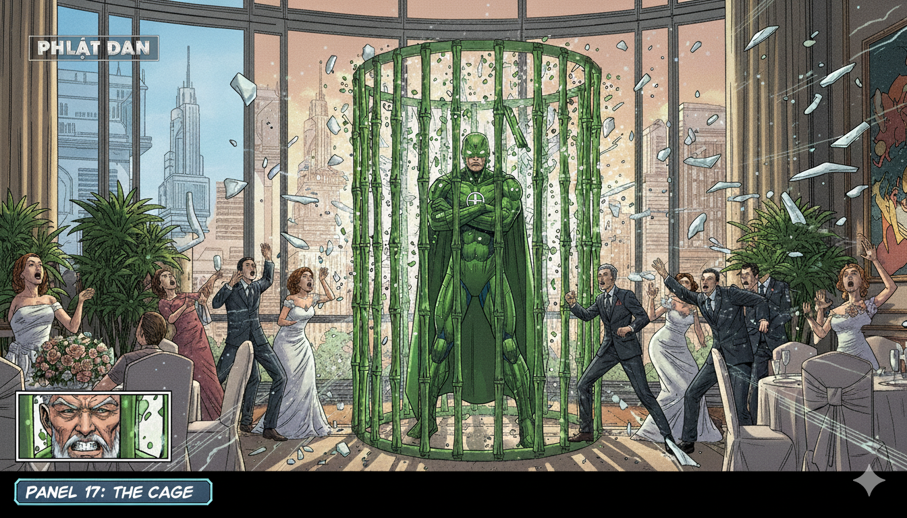

"Ông là phiên bản tương lai của tôi?" Khoai Prime hỏi.

"Tôi là phiên bản tiến hóa của cậu," Khoai-1000 đáp. "Tôi đã học được rằng sự bảo vệ đích thực là sự kiểm soát hoàn toàn. Hãy tham gia cùng chúng tôi, và chúng ta sẽ kết thúc cuộc chiến này mãi mãi."

"Không bao giờ!" Khoai Prime hét lên. "Chúng tôi bảo vệ, không phải thống trị!"

"Thế thì cậu là kẻ thù," Khoai-1000 nói. "Và kẻ thù của Hội Đồng Chinh Phục phải bị loại bỏ."

Nhưng trước khi hai Khoai có thể chiến đấu, The Void xuất hiện - lần này không phải từ một cánh xoáy, mà từ chính không gian xung quanh họ.

"Thú vị," một tiếng nói vang lên từ The Void. "Hai phiên bản của Khoai... hai hệ tư tưởng đối lập... và cả hai đều sai."

The Void ngưng hình thành một thân hình người - một thực thể trung tính, không thể xác định giới tính.

"Tôi không phải kẻ thù của các cậu," thực thể nói. "Tôi là sự cân bằng."

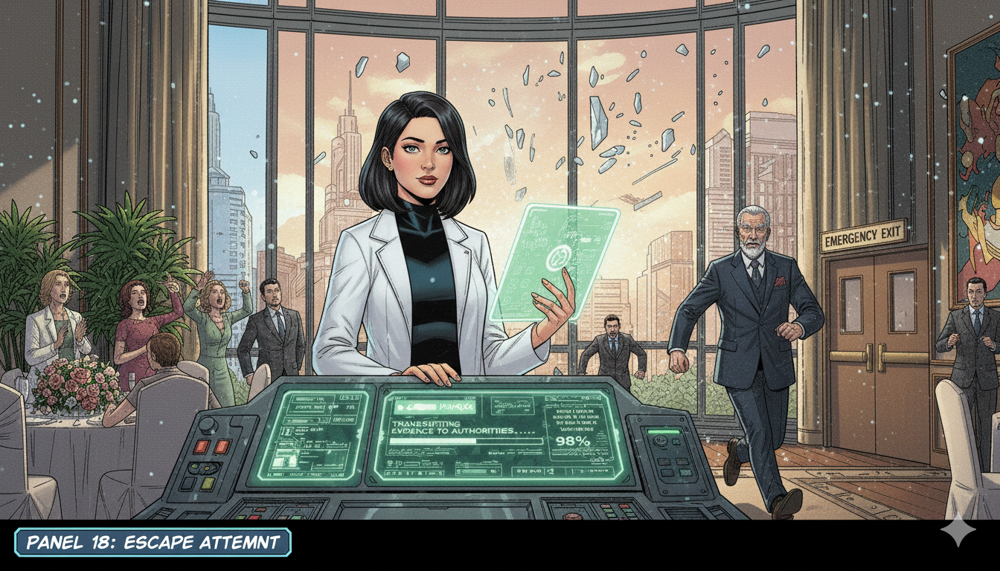

---

## Chương 7: Sự Thật Đằng Sau The Void

"Người là ai?" Bụt-Monk hỏi, tay cầm cây gậy tre phòng thủ.

"Tôi là The Void," thực thể trả lời. "Nhưng không phải phiên bản các cậu đang chiến đấu. Tôi là nguyên bản."

"Người hủy diệt các vũ trụ!" Phú Ông-Overlord hét.

"Tôi không hủy diệt," The Void giải thích. "Tôi tái cấu trúc. Các vũ trụ trở nên không ổn định khi có quá nhiều phiên bản của cùng một thực thể tồn tại song song. Nhiều Khoai, nhiều Cô Út, nhiều Phú Ông... thực tại không thể chịu đựng được."

"Có nghĩa là gì?" Cô Út-Beta hỏi.

"Với mỗi vũ trụ mới được tạo ra từ một lựa chọn khác nhau, thực tại trở nên mỏng manh hơn," The Void nói. "Công việc của tôi là loại bỏ các vũ trụ thừa để duy trì sự ổn định tổng thể."

"Vậy nên người đã giết chết vô số người?" Khoai-Prime hỏi, giọng đầy giận dữ.

"Tôi đã cứu vô số người bằng cách ngăn chặn sự sụp đổ hoàn toàn của thực tại," The Void đáp. "Nếu tất cả các vũ trụ song song tiếp tục tồn tại, tất cả sẽ sụp đổ. Thay vì một vài vũ trụ sống sót, không vũ trụ nào sống sót."

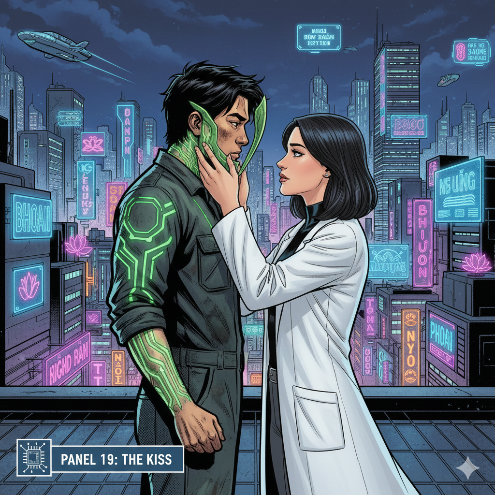

Khoai-1000 cười: "Đó là lý do tại sao chúng tôi cần thống trị. Để kiểm soát quá trình này."

"Sự kiểm soát chỉ dẫn đến sự tham nhũng," The Void nói. "Tôi đã thấy điều này vô số lần. Các vũ trụ cần tự cân bằng."

"Làm thế nào để cân bằng?" Bụt-Monk hỏi.

"Bằng cách hợp nhất," The Void nói. "Không phải xóa bỏ, mà là hợp nhất. Tất cả các phiên bản phải trở thành một."

"Không thể!" Khoai-Prime hét. "Mỗi người chúng tôi là một cá thể riêng biệt!"

"Chính xác," The Void gật đầu. "Và đó là vấn đề. Sự riêng biệt dẫn đến xung đột. Xung đột dẫn đến sự mất ổn định. Mất ổn định dẫn đến sự sụp đổ."

The Void tạo ra một hình ảnh hologram, cho thấy hàng ngàn vũ trụ đang sụp đổ đồng thời.

"Đây là tương lai nếu các cậu không hành động," The Void nói. "Không phải trong một ngàn năm. Không phải trong một trăm năm. Trong vòng mười năm."

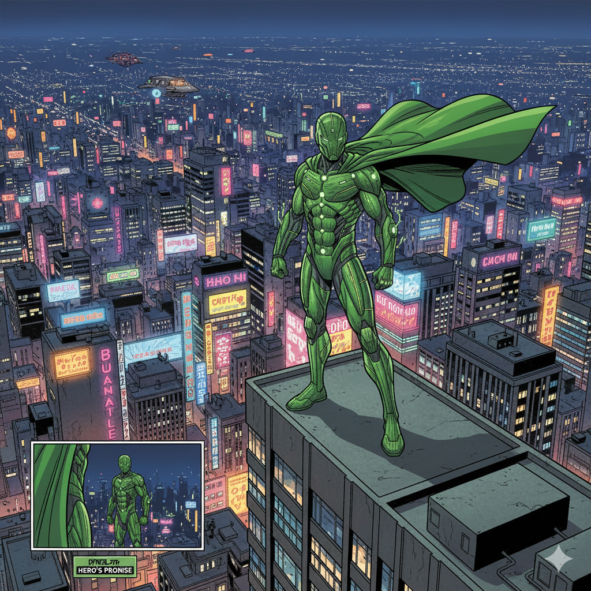

---

## Chương 8: Lựa Chọn Cuối Cùng

Sự im lặng bao trùm phòng khi các Sentinel xử lý những gì họ vừa nghe.

"Vậy nên lựa chọn của chúng ta là gì?" Cô Út-Beta hỏi. "Hợp nhất thành một thực thể hay để tất cả sụp đổ?"

"Có lựa chọn thứ ba," Khoai-Prime nói. "Chúng ta tìm một cách khác để ổn định thực tại."

"Cách nào?" Khoai-1000 hỏi. "Tôi đã nghiên cứu vấn đề này trong hàng ngàn năm. Không có cách nào khác."

"Chưa có ai thử kết hợp sức mạnh của tất cả chúng ta một cách tự nguyện," Khoai-Prime nói. "Không phải hợp nhất, mà là hợp tác. Tạo ra một mạng lưới Sentinel bảo vệ tất cả các vũ trụ."

"Ngây thơ," Khoai-1000 lắc đầu. "Con người luôn tham nhũng. Quyền lực luôn làm hỏng mọi thứ."

"Nhưng hy vọng thì không," Bụt-Monk nói. "Và hy vọng chính là sức mạnh mạnh nhất."

The Void quan sát cuộc thảo luận với sự quan tâm.

"Ý tưởng của cậu... chưa từng được thử trước đây," The Void thừa nhận. "Nhưng xác suất thành công rất thấp."

"Xác suất không quan trọng," Khoai-Prime nói. "Điều quan trọng là chúng ta thử."

Anh nhìn các Sentinel khác. "Tôi sẽ không ép buộc ai. Mỗi người tự lựa chọn."

Cô Út-Beta bước tới bên cạnh Khoai-Prime: "Tôi đi với cậu."

Bụt-Monk gật đầu: "Con đường của Phật là con đường từ bi. Tôi sẽ giúp."

Cô Út-Mechanic: "Công nghệ của tôi thuộc về mọi người."

Phú Ông-Overlord do dự một lúc, rồi gật đầu: "Cho con gái tôi... và cho một cơ hội cứu chuộc."

Khoai-1000 lắc đầu: "Các cậu đang chọn con đường dẫn đến sự hủy diệt."

"Hay là con đường dẫn đến hy vọng," Khoai-Prime đáp. "Người chọn thế nào thì tùy người."

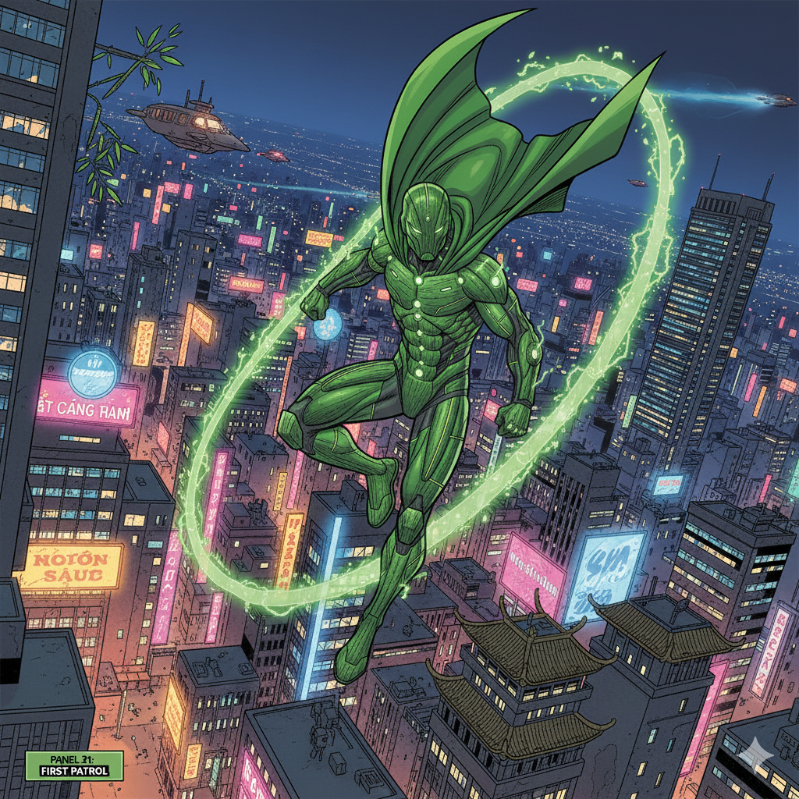

Khoai-1000 sigh: "Rất tốt. Nếu các cậu quyết định tự sát, tôi sẽ không ngăn cản. Nhưng khi các cậu thất bại và thực tại sụp đổ, đừng trách tôi."

Gã bước qua cánh xoáy của mình và biến mất.

The Void nhìn các Sentinel còn lại: "Các cậu đã chọn. Tôi sẽ cho các cậu một cơ hội. Mười năm. Nếu các cậu có thể tạo ra một mạng lưới ổn định đủ mạnh, tôi sẽ ngưng tái cấu trúc. Nếu không..."

The Void không cần hoàn thành câu.

"Mười năm," Khoai-Prime gật đầu. "Chúng ta sẽ sẵn sàng."

---

## Chương 9: Hội Đồng Hộ Vệ Vô Hạn Thực Sự

Một năm sau, Hội Đồng Hộ Vệ Vô Hạn đã mở rộng. Họ đã tìm thấy thêm mười hai Sentinel từ các vũ trụ khác nhau, mỗi người mang kỹ năng và kiến thức riêng biệt.

Tại trung tâm chỉ huy mới - một trạm không gian đa chiều - các Sentinel đang họp.

"Báo cáo từ Universe Kappa-777," một Sentinel mới nói. "Chúng tôi đã ổn định được ba vết nứt thực tại trong tháng qua."

"Báo cáo từ Universe Lambda-451," một Sentinel khác thêm. "The Void không tấn công trong sáu tháng. Tôi nghĩ nó đang cho chúng ta thời gian."

"Và chúng ta cần sử dụng thời gian đó một cách khôn ngoan," Khoai-Prime nói. "Chúng ta đã thành lập Mạng Lưới Bảo Vệ Đa Chiều, nhưng vẫn còn nhiều việc phải làm."

Cô Út-Beta đứng bên cạnh anh, giờ đây là chỉ huy chiến thuật của Hội Đồng.

"Chúng ta đã phát triển công nghệ chia sẻ năng lượng," cô báo cáo. "Bất kỳ Sentinel nào gặp khó khăn đều có thể nhận được hỗ trợ từ các Sentinel khác trong vài giây."

Bụt-Monk đã trở thành lãnh đạo tinh thần, dạy cho các Sentinel mới về cân bằng và hòa hợp.

Phú Ông-Overlord, giờ gọi mình là Phú Ông-Redeemed, dẫn dắt các nỗ lực nghiên cứu để hiểu rõ hơn về bản chất của thực tại.

Khoai-Scavenger, đã hoàn toàn hồi phục, hiện là người chuyên trách các nhiệm vụ giải cứu đa chiều.

"Chúng ta đã làm được nhiều điều," Khoai-Prime nói trong bài phát biểu của mình. "Nhưng hành trình vẫn còn dài. Chín năm nữa, chúng ta phải chứng minh rằng hy vọng có thể chiến thắng sự tuyệt vọng."

Anh nhìn ra qua cửa sổ trạm không gian, nhìn thấy vô số vũ trụ đang lấp lánh.

"Mỗi vũ trụ là một cơ hội. Mỗi Sentinel là một hy vọng. Và cùng nhau, chúng ta là sự bảo vệ cho tất cả."

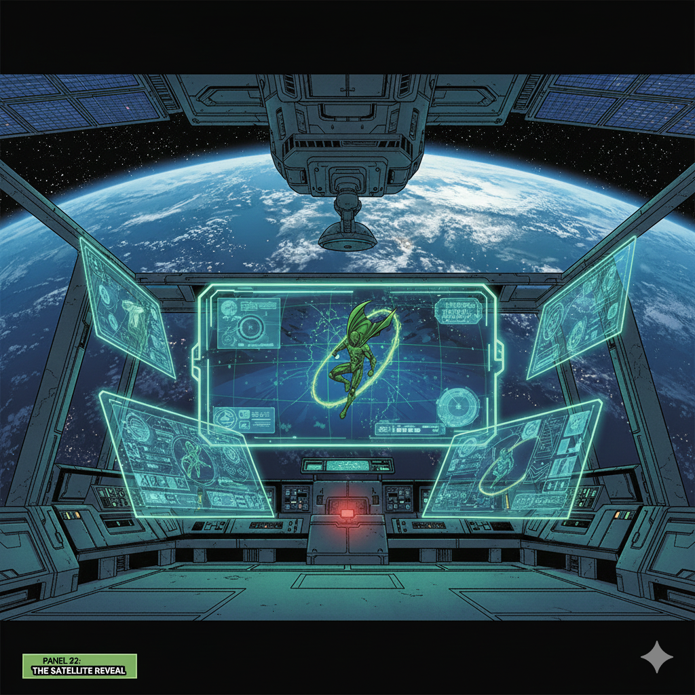

---

## Chương 10: Lời Hứa Mới

Tại Neo Saigon, Khoai Prime và Cô Út của vũ trụ này đang ngồi trên một quán cà phê trên tầng thượng, nhìn thành phố về đêm.

"Anh có bao giờ hối hận không?" Cô Út hỏi. "Khi chọn con đường khó khăn này?"

"Không bao giờ," Khoai Prime mỉm cười. "Dù có khó khăn, nhưng chúng ta đã tạo ra một thứ gì đó đáng giá."

Anh đặt tay lên ngực, và module nanotech bắt đầu phát sáng nhẹ.

"Bụt đã nói sức mạnh này dành cho người có trái tim trong sạch. Tôi nghĩ giờ mình hiểu ý nghĩa thực sự."

"Ý nghĩa là gì?" Cô Út hỏi.

"Không phải là sức mạnh của một người," Khoai Prime nói. "Mà là sức mạnh của nhiều người cùng nhau. Hộ Vệ Tre không phải là một anh hùng. Nó là một biểu tượng của hy vọng."

Cô Út nắm tay anh: "Và anh là biểu tượng tốt nhất."

"Chúng ta đều là biểu tượng," Khoai Prime đáp. "Mỗi Sentinel trong Hội Đồng đều là một mảnh của bức tranh lớn hơn."

Từ xa, một cánh xoáy nhỏ mở ra, và một Sentinel trẻ tuổi bước ra, bị thương và kiệt sức.

"Cần... cần giúp đỡ," anh ta thì thầm.

Khoai Prime đứng dậy: "Công việc chưa bao giờ kết thúc."

Anh nhìn Cô Út: "Sẽ có ngày chúng ta có thể sống bình yên. Nhưng ngày đó chưa phải hôm nay."

"Và khi đó đến," Cô Út mỉm cười, "chúng ta sẽ xứng đáng với nó."

Khoai Prime đặt tay lên ngực: "KHẮC NHẬP!"

Bộ giáp nanotech hình thành, và anh lao vào cánh xoáy, sẵn sàng cho nhiệm vụ tiếp theo.

Bởi vì đó là những gì Hộ Vệ Tre làm. Bảo vệ. Hy vọng. Và không bao giờ từ bỏ.

---

## POST-CREDIT SCENE

Tại một nơi nào đó ngoài không gian và thời gian, Khoai-1000 đang quan sát các hoạt động của Hội Đồng Hộ Vệ Vô Hạn.

"Họ đang tiến triển nhanh hơn dự kiến," một giọng nói máy móc báo cáo.

"Thật vậy," Khoai-1000 gật đầu. "Nhưng tiến triển nhanh cũng có nghĩa là sai lầm nhanh hơn."

Gã quay về phía một màn hình lớn, cho thấy The Void đang quan sát các Sentinel.

"Chuẩn bị Kế hoạch B," gã ra lệnh. "Nếu hy vọng thất bại, sự thống trị sẽ là câu trả lời."

Màn hình chuyển sang màu đỏ, và các hình ảnh về một đội quân Sentinel phiên bản chinh phục xuất hiện.

"Hội Đồng Hộ Vệ Vô Hạn có thể đã chọn hy vọng," Khoai-1000 thì thầm. "Nhưng tôi chọn thực tại. Và thực tại luôn chiến thắng."

---

**The End... or The Beginning?**
