# 🇻🇳 VŨ TRỤ TRUYỆN TRANH VIỆT NAM

## Vietnamese Comic Universe - Nơi Truyền Thuyết Trở Thành Hiện Thực

Chào mừng đến với **Vũ Trụ Truyện Tranh Việt Nam** - một vũ trụ kết nối tất cả các truyền thuyết, cổ tích Việt Nam thành một câu chuyện siêu anh hùng đa chiều, đa vũ trụ, xuyên thời gian.

> **📖 Tài Liệu Dành Cho AI/Developers:** Xem [`CLAUDE.md`](CLAUDE.md) để biết chi tiết về cấu trúc kỹ thuật, format file, và hướng dẫn phát triển.

---

## 📚 TỔNG QUAN

Vũ trụ này bao gồm **4 tuyến truyện chính** và **1 tuyến phản diện**, tất cả kết nối với nhau qua không gian, thời gian và thực tại:

- **🌳 Tuyến Hộ Vệ Tre (Bamboo Guardians)** - Bảo vệ không gian
- **⚔️ Tuyến Khổng Lồ Sắt (Iron Giants)** - Bảo vệ vật chất  
- **⏰ Tuyến Giữ Thời Gian (Time Keepers)** - Bảo vệ thời gian
- **🗺️ Tuyến Thần S Việt (Vietnamese Deities)** - Bảo vệ di sản văn hóa
- **🌑 Tuyến Phản Diện (Villains)** - Nguồn gốc của bóng tối

Tất cả hội tụ tại **Timeline Omega** và **The Eternal Council** - nơi mọi anh hùng và truyền thuyết Việt Nam tồn tại cùng nhau.

---

## 🎯 THỨ TỰ ĐỌC ĐỀ XUẤT

### **PHASE 1: ORIGINS (Nguồn Gốc) - Đọc theo thứ tự bất kỳ**

Các truyện origin có thể đọc độc lập, giới thiệu từng anh hùng:

#### 🌳 Hộ Vệ Tre Origins
1. **[`01-the-bamboo-sentinel.md`](01-the-bamboo-sentinel.md)** - Khoai Prime (Universe Prime)
2. **[`02-the-bamboo-sentinel-beta.md`](02-the-bamboo-sentinel-beta.md)** - Khoai Beta (Universe Beta)
3. **[`03-the-bamboo-monk.md`](03-the-bamboo-monk.md)** - Bụt-Monk (Universe Theta)
4. **[`04-the-bamboo-mechanic.md`](04-the-bamboo-mechanic.md)** - Cô Út-Mechanic (Universe Epsilon)
5. **[`05-the-bamboo-scavenger.md`](05-the-bamboo-scavenger.md)** - Khoai-Scavenger (Universe Delta)
6. **[`06-the-bamboo-overlord.md`](06-the-bamboo-overlord.md)** - Phú Ông-Overlord (Universe Gamma)

#### ⚔️ Khổng Lồ Sắt Origins
7. **[`07-the-iron-sentinel.md`](07-the-iron-sentinel.md)** - Gióng Prime (Universe Prime)
8. **[`08-the-silent-warrior.md`](08-the-silent-warrior.md)** - Gióng-Silent (Universe Beta)
9. **[`09-the-mechanical-titan.md`](09-the-mechanical-titan.md)** - Gióng-Mechanical (Universe Gamma)
10. **[`10-the-corrupted-giant.md`](10-the-corrupted-giant.md)** - Gióng-Corrupted (Universe Delta)

#### ⏰ Time Keepers Origins
11. **[`11-the-time-keeper-tam.md`](11-the-time-keeper-tam.md)** - Tấm origin story

#### 🗺️ Thần S Việt Origins
12. **[`21-son-tinh-mountain-god.md`](21-son-tinh-mountain-god.md)** - Sơn Tinh, Vua Núi Thần
13. **[`22-thuy-tinh-water-god.md`](22-thuy-tinh-water-god.md)** - Thủy Tinh, Vua Biển Thần  
14. **[`23-the-eternal-rivalry.md`](23-the-eternal-rivalry.md)** - Đối đầu vĩnh cửu
15. **[`24-thanh-dong-divine-fisher.md`](24-thanh-dong-divine-fisher.md)** - Thanh Đông, Người Chài Cá Thần
16. **[`25-thach-sanh-monster-slayer.md`](25-thach-sanh-monster-slayer.md)** - Thạch Sanh, Săn Quỷ

#### 🏛️ Việt Hùng Origins
17. **[`26-ly-thong-the-betrayer.md`](26-ly-thong-the-betrayer.md)** - Lý Thông, Kẻ Phản Bội
18. **[`27-thanh-don-tactical-genius.md`](27-thanh-don-tactical-genius.md)** - Thánh Đôn, Thiên Tài Chiến Thuật
19. **[`28-chu-dong-tu-buffalo-boy.md`](28-chu-dong-tu-buffalo-boy.md)** - Chử Đồng Tử, Cậu Bé Trâu
20. **[`29-tien-dung-celestial-princess.md`](29-tien-dung-celestial-princess.md)** - Tiên Dung, Công Chúa Thiên Thần
21. **[`30-tu-bat-tu-four-immortals.md`](30-tu-bat-tu-four-immortals.md)** - Tứ Bất Tử, Bốn Vị Bất Tử
22. **[`31-an-duong-vuong-king-of-citadel.md`](31-an-duong-vuong-king-of-citadel.md)** - An Dương Vương, Vua Thành Truyền
23. **[`32-kim-quy-golden-turtle.md`](32-kim-quy-golden-turtle.md)** - Kim Quy, Rùa Vàng Thần
24. **[`33-ho-guom-sacred-sword.md`](33-ho-guom-sacred-sword.md)** - Hồ Gươm, Gươm Thánh
25. **[`34-le-loi-peoples-king.md`](34-le-loi-peoples-king.md)** - Lê Lợi, Vua Nhân Dân
26. **[`35-au-co-mother-of-nation.md`](35-au-co-mother-of-nation.md)** - Âu Cơ, Mẹ Dân Tộc
27. **[`36-lac-long-quan-dragon-king.md`](36-lac-long-quan-dragon-king.md)** - Lạc Long Quân, Vua Rồng
28. **[`37-birth-of-viet-nation-origin-saga.md`](37-birth-of-viet-nation-origin-saga.md)** - Khởi Nguyên Dân Tộc Việt

---

### **PHASE 2: CONVERGENCE (Hội Tụ) - Đọc theo thứ tự**

Các truyện này kết nối các anh hùng lại với nhau:

29. **[`12-the-bamboo-council.md`](12-the-bamboo-council.md)** - Hội Đồng Hộ Vệ Vô Hạn hình thành
30. **[`13-the-iron-giant-council.md`](13-the-iron-giant-council.md)** - Hội Đồng Khổng Lồ Sắt hình thành + liên kết với Hộ Vệ Tre
31. **[`14-the-broken-timeline-cam.md`](14-the-broken-timeline-cam.md)** - Cám và sự cứu chuộc
32. **[`15-the-time-war.md`](15-the-time-war.md)** - Cuộc chiến xuyên thời đại

---

### **PHASE 3: CRISIS (Khủng Hoảng) - Đọc theo thứ tự**

Mối đe dọa lớn nhất xuất hiện:

33. **[`16-the-convergence.md`](16-the-convergence.md)** - Tất cả timeline hội tụ, tạo Timeline Omega
34. **[`17-the-eternal-council.md`](17-the-eternal-council.md)** - Hội Đồng Vĩnh Cửu được thành lập, kết nối TẤT CẢ

---

### **PHASE 4: VILLAINS (Phản Diện) - Có thể đọc bất kỳ lúc nào**

Khám phá nguồn gốc và động cơ của các phản diện:

35. **[`18-the-voids-beginning.md`](18-the-voids-beginning.md)** - Nguồn gốc của The Void (Không → The Void)
36. **[`19-the-broken-king.md`](19-the-broken-king.md)** - Nguồn gốc của Phú Ông-Temporal
37. **[`20-the-dark-alliance.md`](20-the-dark-alliance.md)** - Liên minh phản diện và sự kết nối

---

## 🗺️ BẢN ĐỒ VŨ TRỤ

### **SƠ ĐỒ LIÊN KẾT TUYẾN TRUYỆN**

```mermaid
graph TB
    %% Timeline Omega - Final Destination
    OMEGA[⭐ Timeline Omega<br/>All Heroes United]
    
    %% Phase 3: Crisis - Leads to Omega
    EC[17-The Eternal Council<br/>🔮 Hội Đồng Vĩnh Cửu] --> OMEGA
    CONV[16-The Convergence<br/>🌌 Hội Tụ Timeline] --> EC
    
    %% Phase 2: Convergence - Leads to Crisis
    BC[12-Bamboo Council<br/>🌳 Hội Đồng Hộ Vệ] --> CONV
    GC[13-Iron Giant Council<br/>⚔️ Hội Đồng Khổng Lồ] --> CONV
    BTC[14-Broken Timeline Cam<br/>⏰ Cám Cứu Chuộc] --> CONV
    TW[15-Time War<br/>⚔️ Chiến Thời Gian] --> CONV
    ER[23-Eternal Rivalry<br/>🗺️ Sơn Tinh vs Thủy Tinh] --> CONV
    VG[25-Thạch Sanh<br/>🏹 Săn Quỷ] --> CONV
    VH[37-Birth of Việt Nation<br/>🏛️ Khởi Nguyên Dân Tộc] --> CONV
    
    %% Villains - Influence Convergence
    DA[20-The Dark Alliance<br/>🌑 Liên Minh Phản Diện] --> CONV
    V1[18-The Void's Beginning<br/>⚫ Nguồn Gốc The Void] --> DA
    V2[19-The Broken King<br/>👑 Phú Ông-Temporal] --> DA
    
    %% Phase 1: Origins - Bamboo Guardians
    B1[01-The Bamboo Sentinel<br/>🌴 Khoai Prime] --> BC
    B2[02-Bamboo Sentinel Beta<br/>🌴 Khoai Beta] --> BC
    B3[03-Bamboo Monk<br/>🌴 Bụt-Monk] --> BC
    B4[04-Bamboo Mechanic<br/>🌴 Cô Út-Mechanic] --> BC
    B5[05-Bamboo Scavenger<br/>🌴 Khoai-Scavenger] --> BC
    B6[06-Bamboo Overlord<br/>🌴 Phú Ông-Overlord] --> BC
    
    %% Phase 1: Origins - Iron Giants
    G1[07-Iron Sentinel<br/>⚡ Gióng Prime] --> GC
    G2[08-Silent Warrior<br/>⚡ Gióng-Silent] --> GC
    G3[09-Mechanical Titan<br/>⚡ Gióng-Mechanical] --> GC
    G4[10-Corrupted Giant<br/>⚡ Gióng-Corrupted] --> GC
    
    %% Phase 1: Origins - Time Keepers
    T1[11-Time Keeper Tam<br/>⏰ Tấm Origin] --> BTC
    T1 --> TW
    
    %% Phase 1: Origins - Vietnamese Deities
    D1[21-Sơn Tinh<br/>⛰️ Vua Núi Thần] --> ER
    D2[22-Thủy Tinh<br/>🌊 Vua Biển Thần] --> ER
    V3[24-Thanh Đông<br/>🎣 Người Chài Cá] --> VG
    
    %% Phase 1: Origins - Vietnamese Heroes
    H1[26-Lý Thông<br/>🗡️ Kẻ Phản Bội] --> VH
    H2[27-Thánh Đôn<br/>🧠 Thiên Tài Chiến Thuật] --> VH
    H3[28-Chử Đồng Tử<br/>🐃 Cậu Bé Trâu] --> VH
    H4[29-Tiên Dung<br/>👸 Công Chúa Thiên Thần] --> VH
    H5[30-Tứ Bất Tử<br/>✨ Bốn Vị Bất Tử] --> VH
    H6[31-An Dương Vương<br/>🏰 Vua Thành Truyền] --> VH
    H7[32-Kim Quy<br/>🐢 Rùa Vàng Thần] --> VH
    H8[33-Hồ Gươm<br/>⚔️ Gươm Thánh] --> VH
    H9[34-Lê Lợi<br/>👑 Vua Nhân Dân] --> VH
    H10[35-Âu Cơ<br/>👩‍👧‍👦 Mẹ Dân Tộc] --> VH
    H11[36-Lạc Long Quân<br/>🐉 Vua Rồng] --> VH
    
    %% Styling
    classDef bamboo fill:#2E7D32,stroke:#1B5E20,color:#fff,font-weight:bold
    classDef iron fill:#795548,stroke:#5D4037,color:#fff,font-weight:bold
    classDef time fill:#1976D2,stroke:#0D47A1,color:#fff,font-weight:bold
    classDef deity fill:#F57C00,stroke:#E65100,color:#fff,font-weight:bold
    classDef viet fill:#D32F2F,stroke:#B71C1C,color:#fff,font-weight:bold
    classDef villain fill:#424242,stroke:#212121,color:#fff,font-weight:bold
    classDef council fill:#9C27B0,stroke:#6A1B9A,color:#fff,font-weight:bold
    classDef omega fill:#FFD700,stroke:#FFA000,color:#000,font-weight:bold
    
    class B1,B2,B3,B4,B5,B6,BC bamboo
    class G1,G2,G3,G4,GC iron
    class T1,BTC,TW time
    class D1,D2,ER,V3,VG deity
    class H1,H2,H3,H4,H5,H6,H7,H8,H9,H10,H11,VH viet
    class V1,V2,DA villain
    class CONV,EC council
    class OMEGA omega
```



### **Timeline Omega (Trung Tâm)**
Nơi tất cả timeline hội tụ sau The Convergence. Đây là timeline chính của vũ trụ.

### **Các Timeline Khác**
- **Universe Prime (Alpha)** - Timeline gốc của Khoai Prime và Gióng Prime
- **Universe Beta** - Timeline của các chiến binh im lặng
- **Universe Gamma** - Timeline steampunk
- **Universe Delta** - Timeline tối tăm
- **Universe Epsilon** - Timeline cơ khí
- **Universe Theta** - Timeline tâm linh
- **Universe Omega-0001** - Timeline của Time Keepers

### **Timeline Zero**
Điểm khởi đầu của tất cả timeline. Nơi Timeweavers tạo ra hệ thống thời gian.

---

## 🦸 CÁC HỘI ĐỒNG

### **1. Hội Đồng Hộ Vệ Vô Hạn (Infinite Bamboo Council)**
- **Lãnh đạo:** Khoai Prime
- **Sức mạnh:** Nanotech, linh hoạt, bảo vệ không gian
- **Biểu tượng:** Tre (Bamboo)
- **Thành viên:** Các Bamboo Sentinels từ nhiều vũ trụ

### **2. Hội Đồng Khổng Lồ Sắt (Iron Giant Council)**
- **Lãnh đạo:** Gióng Prime
- **Sức mạnh:** Titan cơ khí, vững chắc, bảo vệ vật chất
- **Biểu tượng:** Sắt (Iron)
- **Thành viên:** Các Gióng từ nhiều vũ trụ

### **3. Temporal Order (Time Keepers)**
- **Lãnh đạo:** Khoai-Temporal, Tấm, Cám
- **Sức mạnh:** Du hành thời gian, bảo vệ timeline
- **Biểu tượng:** Đồng Hồ (Clock)
- **Thành viên:** Các Time Keepers từ nhiều timeline

### **4. The Eternal Council (Hội Đồng Vĩnh Cửu)**
- **Mục đích:** Kết hợp tất cả 3 hội đồng trên
- **Thành viên:** Đại diện từ mọi hội đồng + các thần linh
- **Sứ mệnh:** Bảo vệ Timeline Omega và tất cả thực tại

---

## 😈 PHẢN DIỆN CHÍNH

### **The Void (Không)**
- **Nguồn gốc:** Nhà khoa học Timeweavers trở thành quái vật
- **Động cơ:** Cố gắng cứu vũ trụ bằng cách hy sinh timeline
- **Kết cục:** Tìm thấy sự cứu chuộc, chết trong hòa bình

### **Phú Ông-Temporal**
- **Nguồn gốc:** Người cha yêu con, ám ảnh với timeline hoàn hảo
- **Động cơ:** Tạo ra thế giới nơi gia đình anh hạnh phúc
- **Kết cục:** Một số phiên bản được cứu chuộc, một số không

### **The Architect**
- **Nguồn gốc:** Phần tối tăm của The Void
- **Động cơ:** Tạo ra hỗn loạn và kiểm soát tuyệt đối
- **Kết cục:** Bị đánh bại bởi liên minh anh hùng và phản diện đã thay đổi

### **Dark Alliance**
- **Thành viên:** Các phản diện từ mọi timeline
- **Mục đích:** Lật đổ các hội đồng
- **Kết cục:** Phân rẽ, một số tìm sự cứu chuộc

---

## 🎨 THEMES CHÍNH

1. **Đoàn Kết:** Sức mạnh đến từ việc cùng nhau, không phải một mình
2. **Cứu Chuộc:** Mọi người đều xứng đáng có cơ hội thứ hai
3. **Gia Đình:** Tình yêu gia đình có thể cứu hoặc phá hủy
4. **Quyền Lực:** Quyền lực tuyệt đối làm hỏng tuyệt đối
5. **Thời Gian:** Không thể kiểm soát mọi thứ, phải để tự nhiên
6. **Di Sản:** Truyền thuyết sống mãi qua thế hệ

---

## 🌟 ĐẶC ĐIỂM ĐỘC ĐÁO

### **1. Kết Nối Truyền Thuyết Việt Nam**
- Thánh Gióng → Iron Titans
- Cây Tre Trăm Đốt → Bamboo Sentinels
- Tấm Cám → Time Keepers
- Và nhiều truyền thuyết khác...

### **2. Đa Vũ Trụ & Du Hành Thời Gian**
- Mỗi truyền thuyết có nhiều phiên bản trong các vũ trụ khác nhau
- Du hành qua lịch sử Việt Nam (Hùng Vương, Hai Bà Trưng, Trần, Lê Lợi...)
- Timeline hội tụ tạo ra Timeline Omega

### **3. Phản Diện Có Chiều Sâu**
- Không phải ác thuần túy
- Có nguồn gốc và động cơ rõ ràng
- Có thể tìm thấy sự cứu chuộc

### **4. Văn Hóa Việt Nam**
- Tên nhân vật, địa điểm Việt Nam
- Giá trị văn hóa truyền thống
- Lịch sử Việt Nam được tôn trọng

---

## 📖 CÁCH ĐỌC TỐT NHẤT

### **Cho Người Mới:**
1. Đọc một origin story từ mỗi tuyến ([`01-the-bamboo-sentinel.md`](01-the-bamboo-sentinel.md), [`07-the-iron-sentinel.md`](07-the-iron-sentinel.md), [`11-the-time-keeper-tam.md`](11-the-time-keeper-tam.md), [`21-son-tinh-mountain-god.md`](21-son-tinh-mountain-god.md))
2. Đọc các truyện Convergence theo thứ tự ([`12-`](12-the-bamboo-council.md) đến [`15-`](15-the-time-war.md))
3. Đọc Crisis arc ([`16-`](16-the-convergence.md) đến [`17-`](17-the-eternal-council.md))
4. Đọc Villains arc ([`18-`](18-the-voids-beginning.md) đến [`20-`](20-the-dark-alliance.md)) để hiểu sâu hơn

### **Cho Fan Hardcore:**
1. Đọc TẤT CẢ origins theo thứ tự ([`01-`](01-the-bamboo-sentinel.md) đến [`11-`](11-the-time-keeper-tam.md), [`21-`](21-son-tinh-mountain-god.md) đến [`37-`](37-birth-of-viet-nation-origin-saga.md))
2. Đọc Convergence ([`12-`](12-the-bamboo-council.md) đến [`15-`](15-the-time-war.md))
3. Đọc Crisis ([`16-`](16-the-convergence.md) đến [`17-`](17-the-eternal-council.md))
4. Đọc Villains ([`18-`](18-the-voids-beginning.md) đến [`20-`](20-the-dark-alliance.md))
5. Đọc lại từ đầu để bắt các chi tiết kết nối

### **Theo Tuyến Nhân Vật:**
- **Tuyến Khoai:** [`01-the-bamboo-sentinel.md`](01-the-bamboo-sentinel.md) → [`12-the-bamboo-council.md`](12-the-bamboo-council.md) → [`16-the-convergence.md`](16-the-convergence.md) → [`17-the-eternal-council.md`](17-the-eternal-council.md)
- **Tuyến Gióng:** [`07-the-iron-sentinel.md`](07-the-iron-sentinel.md) → [`13-the-iron-giant-council.md`](13-the-iron-giant-council.md) → [`16-the-convergence.md`](16-the-convergence.md) → [`17-the-eternal-council.md`](17-the-eternal-council.md)
- **Tuyến Tấm/Cám:** [`11-the-time-keeper-tam.md`](11-the-time-keeper-tam.md) → [`14-the-broken-timeline-cam.md`](14-the-broken-timeline-cam.md) → [`15-the-time-war.md`](15-the-time-war.md) → [`16-the-convergence.md`](16-the-convergence.md) → [`17-the-eternal-council.md`](17-the-eternal-council.md)
- **Tuyến Thần S Việt:** [`21-son-tinh-mountain-god.md`](21-son-tinh-mountain-god.md) → [`22-thuy-tinh-water-god.md`](22-thuy-tinh-water-god.md) → [`23-the-eternal-rivalry.md`](23-the-eternal-rivalry.md) → [`16-the-convergence.md`](16-the-convergence.md) → [`17-the-eternal-council.md`](17-the-eternal-council.md)
- **Tuyến Việt Hùng:** [`26-ly-thong-the-betrayer.md`](26-ly-thong-the-betrayer.md) → [`27-thanh-don-tactical-genius.md`](27-thanh-don-tactical-genius.md) → [`28-`](28-chu-dong-tu-buffalo-boy.md) đến [`37-`](37-birth-of-viet-nation-origin-saga.md) → [`16-the-convergence.md`](16-the-convergence.md) → [`17-the-eternal-council.md`](17-the-eternal-council.md)

---

## 🚀 TƯƠNG LAI

Vũ trụ này sẽ tiếp tục mở rộng với:
- Thêm nhiều truyền thuyết Việt Nam
- Thêm nhiều timeline và vũ trụ
- Thêm nhiều anh hùng và phản diện
- Thêm nhiều arc và saga

Xem `plan-next-stories.md` để biết các truyện sắp tới.

---

## 📊 THỐNG KÊ

- **Tổng số truyện:** 37
- **Tổng số file prompt:** 37 (đã hoàn chỉnh)
- **Số tuyến truyện:** 5 (4 anh hùng + 1 phản diện)
- **Số vũ trụ:** 10+
- **Số timeline:** Vô hạn
- **Số nhân vật chính:** 50+
- **Số hội đồng:** 4

### **📝 File Prompts Hoàn Chỉnh**
Tất cả 37 truyện đều có file **image generation prompts** tương ứng trong thư mục [`prompts/`](prompts/) với format `[number]-[story-name]-prompts.md`:
- **Structure:** 10 chapters × 2 prompts + EPILOGUE + POST-CREDIT
- **Total prompts:** 740+ detailed image generation prompts
- **Content:** Character designs, backgrounds, art style guidelines
- **Purpose:** Sẵn sàng cho AI image generation
- **Location:** [`prompts/`](prompts/) - Xem đầy đủ trong [`prompts/README.md`](prompts/README.md)

### **🎨 Prompts Features**
- **Detailed descriptions** cho từng scene
- **Character design references** cho consistency
- **Background settings** cho world-building
- **Art style guidelines** cho visual consistency
- **Vietnamese cultural elements** được tích hợp

---

## 💡 GHI CHÚ

- Tất cả truyện được viết bằng tiếng Việt
- Có thể đọc độc lập nhưng đọc theo thứ tự sẽ hiểu rõ hơn
- Mỗi truyện có độ dài tương đương một comic issue
- Post-credit scenes quan trọng - đừng bỏ qua!

---

## 🎬 QUOTE NỔI BẬT

> "Chúng tôi là Hội Đồng Vĩnh Cửu.  
> Chúng tôi bảo vệ không gian, thời gian, và thực tại.  
> Chúng tôi là tre - linh hoạt nhưng không gãy.  
> Chúng tôi là sắt - cứng rắn nhưng không vỡ.  
> Chúng tôi là thời gian - luôn chuyển động nhưng không quên.  
> Chúng tôi là một. Chúng tôi là vĩnh cửu."

---

## 📂 CẤU TRÚC DỰ ÁN

```
ai-vn-comic/
├── 01-37-[story-name].md       # 37 truyện hoàn chỉnh
├── prompts/                     # 740+ AI image generation prompts
│   ├── 01-37-*-prompts.md      # Prompts cho từng truyện
│   └── README.md                # Hướng dẫn prompts
├── images/                      # Hình ảnh được tạo
├── README.md                    # Tài liệu chính (file này)
├── CLAUDE.md                    # Hướng dẫn kỹ thuật cho AI/developers
├── plan-next-stories.md         # Kế hoạch truyện tương lai
└── execution-plan-arc1-5.md     # Lộ trình chi tiết Arc 1-5
```

---

## 📞 LIÊN HỆ & ĐÓNG GÓP

Vũ trụ này là dự án mở. Mọi ý tưởng về truyền thuyết Việt Nam mới đều được chào đón!

### Tài Liệu Tham Khảo
- **[`README.md`](README.md)** - Tài liệu chính cho người đọc (Vietnamese)
- **[`CLAUDE.md`](CLAUDE.md)** - Hướng dẫn kỹ thuật cho AI agents & developers (English)
- **[`plan-next-stories.md`](plan-next-stories.md)** - Kế hoạch phát triển các truyện tiếp theo
- **[`execution-plan-arc1-5.md`](execution-plan-arc1-5.md)** - Lộ trình thực thi chi tiết cho Arc 1-5
- **[`prompts/`](prompts/)** - Thư mục chứa tất cả prompts cho AI image generation

---

**Chúc bạn đọc truyện vui vẻ! 🇻🇳✨**

**Nhớ rằng: Trong Timeline Omega, mọi truyền thuyết đều sống mãi!**
