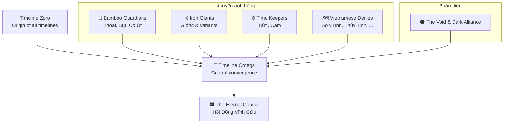

# Vũ Trụ Truyện Tranh Việt Nam

**Vietnamese Comic Universe — Nơi Truyền Thuyết Trở Thành Hiện Thực.**

Đây là trang web của dự án kể chuyện **ai-vn-comic** — một vũ trụ kết nối 37
truyền thuyết và cổ tích Việt Nam thành các truyện siêu anh hùng đa chiều
giống Marvel / DC, nhưng bám sâu vào văn hóa Việt.

## Nhanh

- **37 truyện** độc lập, kết nối qua **Timeline Omega** và các hội đồng
  (`Hội Đồng Hộ Vệ Vô Hạn`, `Hội Đồng Khổng Lồ Sắt`, `Hội Đồng Vĩnh Cửu`).
- **568 prompt** hình minh họa AI (anime / cyberpunk Neo Saigon + mỹ thuật
  Việt truyền thống), song song từng chương truyện.
- **5 tuyến truyện chính** (4 anh hùng + 1 phản diện) + các arc hội tụ.

## Bắt đầu đọc

- **[Hướng dẫn đọc](reading-order.md)** — thứ tự gợi ý qua 3 phase
  (Origins → Convergence → Cultural Heritage).
- **[Truyện](stories/index.md)** — toàn bộ 37 file, tìm kiếm được theo
  nhân vật, vũ trụ, hoặc khái niệm.
- **[Nhân vật](characters.md)** — sổ tay nhân vật chính và các phiên bản
  đa vũ trụ của họ.
- **[Vũ trụ & dòng thời gian](timelines.md)** — mô tả từng universe
  (Prime, Alpha, Beta, Gamma, Delta, Epsilon, Theta, …) và Timeline Omega.
- **[Thuật ngữ](glossary.md)** — các khái niệm then chốt: Khắc nhập,
  The Void, Hội Đồng, nanotech bamboo, …

## Bản đồ vũ trụ

## Cho nhà phát triển / đóng góp

- Nguồn trên GitHub: <https://github.com/captain-corgi/ai-vn-comic>
- Hướng dẫn kỹ thuật: [`CLAUDE.md`](https://github.com/captain-corgi/ai-vn-comic/blob/DevMaster/CLAUDE.md)
- Kiểm tra nhất quán cấu trúc: `python3 tools/check_structure.py`
- Dựng site cục bộ: `pip install -r requirements-docs.txt && python3 tools/build_docs.py --serve`
